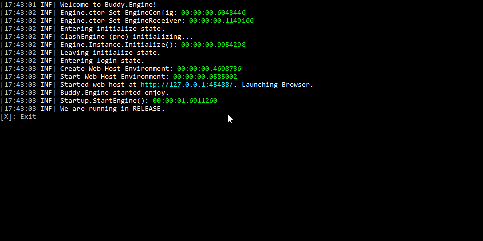
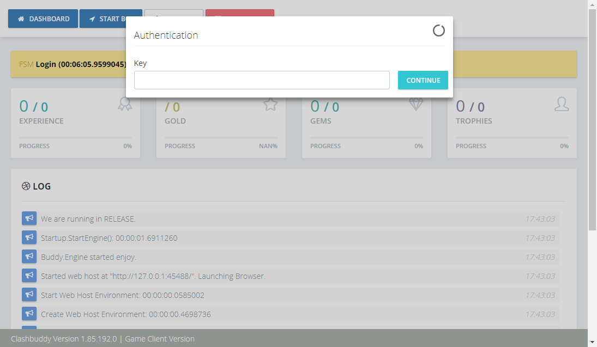
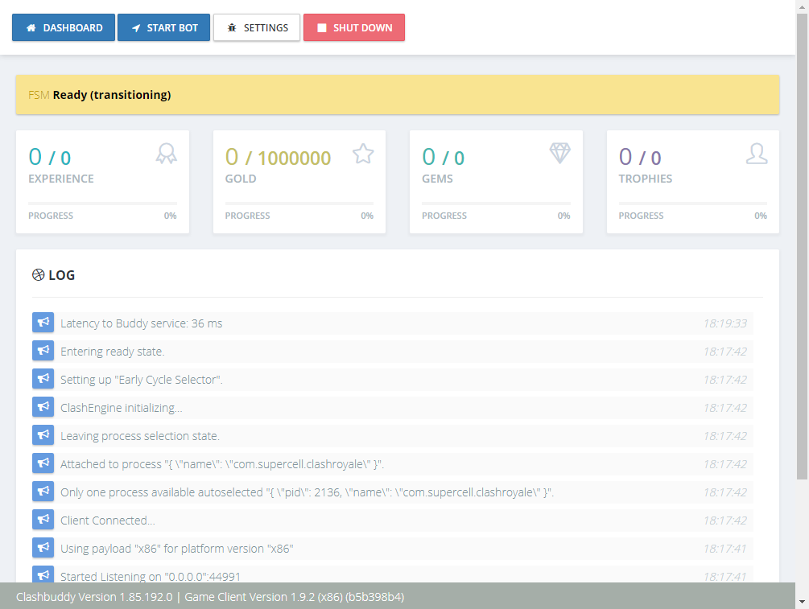

# Getting Started with ClashBuddy

Getting started using ClashBuddy is very straight forward.

## Device Setup

You need an android device that allows you to run the game. The easiest way to get a device is an emulator. Follow one of our guides to get started.

* [MEmu](./MEmu.md)
* [Bluestacks 3](./Bulestacks%203.md)
* [Lenovo Moto G5/G5 Plus](./Lenovo%20Moto%20G5%20Plus.md)

Once your device is ready you have multiple options to install the target game. Either you get the [APK from a mirror](http://www.apkmirror.com/apk/supercell/clash-royale-supercell/) or you install the game from the [Google Play Store](https://play.google.com/store/apps/details?id=com.supercell.clashroyale). Once the game is installed you're ready to run the bot.

## Bot Setup

Go to the [ClashBuddy Home](http://www.clashbuddy.io/) and download the latest version of the bot. It will come in a zip file. To use the bot extract the files to a folder for example C:\BOTS\ClashBuddy. Inside this folder you will find a Buddy.Launcher executeable. This is the main assembly of the bot. Start the launcher and you will see a console window open.

The Launcher will open a browser window with that contains the ui of the bot.
First thing you will have to do is authenticating with your key. If you don't have a key go to the [ClashBuddy Shop](http://www.clashbuddy.io/) and order one there.

The next screen is the Device Setup screen.

When you click on the Add button you will be able to enter host and port of a not shown device. Select your device and click continue.
When only one device is connected this step is skipped and the bot will connect to the device and start the game when required.

Before starting the Bot you need to setup an action selector. This handles what action to cast where. You can find the action selector selection in the settings area.

During the tutorial use the Sequence Action selector up to the point where you enter your new name. From then it depends on your deck. What action selecor you want to use. The Early Cycle Selector is working okisch for a deck similar to this.

* Knight
* Archer
* Bomber
* Baby Dragon
* Mini P.E.K.K.A
* Giant
* Musketeer
* Skeleton Army

Here you find some info on [Trouble Shooting](./Trouble%20Shooting.md).